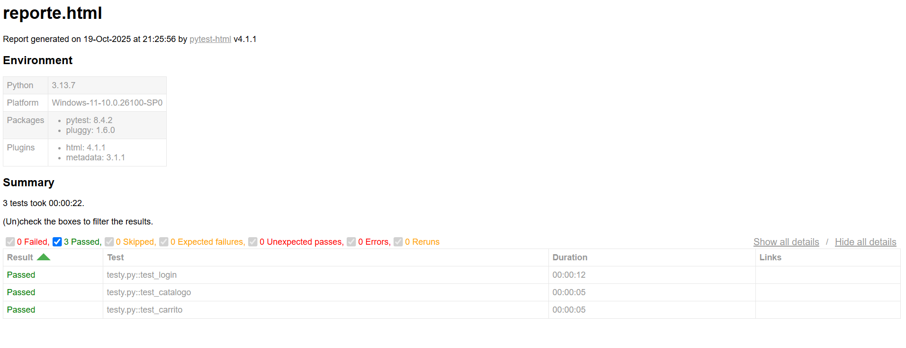

# 📦 Preentrega: Automatización con Selenium y Pytest 🤖

Este proyecto forma parte de la preentrega para la materia de Testing Automatizado. Utiliza **Selenium** y **Pytest** para validar funcionalidades clave del sitio [SauceDemo](https://www.saucedemo.com).

## 📚 Objetivos del proyecto

- Automatizar pruebas funcionales usando Selenium  
- Validar resultados con Pytest
- Realizar login en el sitio
- Verifica que el catálogo de productos este visible
- Añadir un producto al carrito y que valide el contador

## 📂 Estructura del proyecto

├── testy.py # Archivo principal de tests 
├── preentrega.py # Funciones auxiliares: login, catálogo, carrito 
├── reporte.html # Reporte generado por pytest-html 
├── README.md # Este archivo

## 🛠️ Tecnologías utilizadas

- Python 3.x  
- Selenium  
- Pytest  
- Git y GitHub

## 🧰 Narrativa educativa

Cada prueba representa una misión que se debe completar.  
Los mensajes de éxito y error están diseñados para motivar y enseñar,  
transformando errores en oportunidades de aprendizaje.

## 🚀 Cómo ejecutar

1. Cloná el repositorio:

git clone https://github.com/FranMari/pre-entrega-automation-testing-nohelia-zapata-alva.git

## ⚙️ Instalación rápida

pip install selenium pytest pytest-html

## 🧪 Cómo ejecutar los tests

pytest testy.py -v --html=reporte.html

## 📸 Captura del reporte

